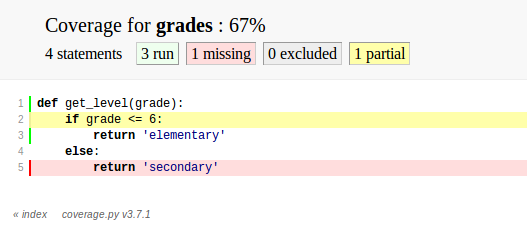

:title: Python Testing Tools
:author: Carl Meyer
:description: a presentation for ConFoo 2014
:keywords: presentation, python, testing, confoo

:skip-help: true
:data-transition-duration: 400

----

:id: title

Python Testing Tools
====================

|hcard|

----

:id: thistalk
:data-reveal: 1

This talk
---------

* py.test

* test marking & skipping

* parametrized tests

* fixtures

* coverage

* tox

----

:data-reveal: 1

How
----

* Introduce a feature

* Example(s)

* Further exploration

* Link to docs

* Python 3

.. note::

   Docs links on final slide. No stress; doc links will be live in online
   slides.

   All code is Py3, but will note Py2 differences.

----

:data-reveal: 1

Me
----

* Writing Python since 2002.

* Professionally since 2007.

* Mostly web development.

* OSS: pip, virtualenv, Django

* OddBird: custom web tools for humans

----

:data-emphasize-lines-step: 1,3,5,7,9,10

py.test
=======

grades.py
---------

.. code:: python
   :number-lines:

   def get_level(grade):
       if grade <= 6:
           return 'elementary'
       else:
           return 'secondary'

.. invisible-code-block: python

   import sys, types
   sys.modules['grades'] = types.ModuleType('grades')
   sys.modules['grades'].get_level = get_level

test_grades.py
--------------

.. code:: python
   :number-lines:

   import grades

   def test_get_level():
       assert grades.get_level(2) == 'elementary'

.. note::

   py.test will find and run tests in any file whose name begins with
   "test\_". Test functions also need to have names beginning with "test".

   Matching up "grades.py" with "test_grades.py" is not necessary, though often
   helpful to keep tests organized.

   (These naming conventions are customizable.)

   Low-boilerplate tests: plain functions, plain asserts.

----

:data-emphasize-lines-step: 1,2,4,5,7,9

.. code::
   :number-lines:

   $ pip install pytest

.. code::
   :number-lines:

   $ py.test
   ============== test session starts ========================
   platform linux -- Python 3.3.2 -- py-1.4.20 -- pytest-2.5.2
   collected 1 items

   test_grades.py .

   ============== 1 passed in 0.01 seconds ===================

.. note::

   To run the tests, just "pip install pytest" and run "py.test" - it will
   automatically find and run your tests. Here it runs our one test, which
   passes!

----

:data-pytest-highlight: 1
:data-emphasize-lines-step: 6,12,13,14,15,18

Helpful failures
----------------

.. code::
   :number-lines:

   $ py.test
   ================ test session starts ======================
   platform linux -- Python 3.3.2 -- py-1.4.20 -- pytest-2.5.2
   collected 1 items

   test_grades.py F

   ================ FAILURES ==================================
   ________________ test_get_level ____________________________

       def test_get_level():
   >       assert grades.get_level(2) == 'secondary'
   E       assert 'elementary' == 'secondary'
   E         - elementary
   E         + secondary

   test_grades.py:4: AssertionError
   ================ 1 failed in 0.02 seconds ==================

----

:data-reveal: 1

Python test runners
===================

A brief synopsis and digression
-------------------------------

* We saw `py.test`_ in action: ``pip install pytest; py.test``

  .. _py.test: http://pytest.org

* `Nose`_ is similar: ``pip install nose; nosetests``

  .. _Nose: https://nose.readthedocs.org/

* Both can run simple function tests with asserts.

* `unittest`_ is in the standard library, similar to "xUnit" test frameworks in
  various languages. Tests require a bit more boilerplate. ``python -m unittest
  discover``

  .. _unittest: http://docs.python.org/3.3/library/unittest.html

* Others: `twisted.trial`_, `zope.testrunner`_

  .. _twisted.trial: http://twistedmatrix.com/trac/wiki/TwistedTrial
  .. _zope.testrunner: https://pypi.python.org/pypi/zope.testrunner

.. note::

   If all these choices are overwhelming, don't worry about it. They're all
   fine, just pick one and run with it.

   My choice is py.test, so that's what I'll be covering today.

----

:data-reveal: 1

Choosing tests to run
---------------------

* Name a test file: ``py.test path/to/test_grades.py``

* Name a directory: ``py.test some/tests/``

* Match test function/class name: ``py.test -k grades``

* Select tests by "mark": ``py.test -m "not slow"``

.. note::

   Flexible matching of tests to run - very important for fast edit/test
   cycles, especially in larger projects.

   Select by mark - which raises the question...

----

:data-emphasize-lines-step: 3
:data-reveal: 1

Wait, what's a "mark"?
----------------------

.. code:: python
   :number-lines:

   import pytest

   @pytest.mark.slow
   def test_something_very_slow():
       """Can download the internet."""
       # ...

* ``py.test -m slow`` will run only tests with this mark.

* ``py.test -m "not slow"`` will run only tests without it.

* Can also use ``and`` / ``or`` for conditions with multiple marks.

.. note::

   You can use any mark names you want (valid Python identifiers) or configure
   a restricted set for the project in your ``pytest.ini`` file.

----

:data-emphasize-lines-step: 2,3,4,5,6,7,8,9

pytest.ini
----------

.. code:: ini
   :number-lines:

   [pytest]
   minversion = 2.4.2
   addopts = --strict --cov-report html --cov myproj
   norecursedirs = .* _* selenium node_modules qunit
   python_files = test_*.py
   python_classes = Test
   python_functions = test
   markers =
       slow: mark a test as slow
       web: mark a test as a web test

.. note::

   All optional.

   If you use markers, recommended to list valid markers so there's one
   reference point for all markers used, and typos become errors (with
   ``strict``). At some point in the future pytest may require markers to be
   registered.

----

:data-reveal: 1

Classes?
--------

.. code:: python

   class TestPager:
       def test_num_pages(self):
           """Can calculate total number of pages."""
           assert pager(count=23, pagesize=10).num_pages == 3

       def test_item_range(self):
           """Can calculate range of items to be shown."""
           # ...

* Can use classes to group related tests, but not required.

* Unlike ``unittest``, no special ``TestCase`` class to inherit from.

* Avoid using classes for setup/teardown (use fixtures).

* Avoid using classes to parametrize tests (use parametrized tests).

----

:data-emphasize-lines-step: 4,5

Test skipping
=============

Not all tests can run in all environments.
------------------------------------------

.. code:: python
   :number-lines:

   import sys
   import pytest

   @pytest.mark.skipif(
       sys.platform != 'win32', reason='Windows specific')
   def test_updates_registry():
       """Checks and updates registry entries."""
       # ...

.. note::

   Can mark any test to be skipped under some conditions.

----

:data-emphasize-lines-step: 6,9,16

.. code::
   :number-lines:

   $ py.test
   ================ test session starts ======================
   platform linux -- Python 3.3.2 -- py-1.4.20 -- pytest-2.5.2
   collected 4 items

   test_grades.py ...s

   ================ 3 passed, 1 skipped in 0.02 seconds ======

.. code::
   :number-lines:

   $ py.test -rs
   ================ test session starts ======================
   platform linux -- Python 3.3.2 -- py-1.4.20 -- pytest-2.5.2
   collected 4 items

   test_grades.py ...s
   ================ short test summary info ==================
   SKIP [1] /.../_pytest/skipping.py:132: Windows specific

   ================ 3 passed, 1 skipped in 0.02 seconds ======

.. note::

   Skipped tests show up as an 's' instead of a '.'.

   Run py.test with '-rs' to show reasons for skipped tests.

----

:data-emphasize-lines-step: 4,5
:data-reveal: 1

Expected failures
=================

Sometimes we expect a test to fail, for now.
--------------------------------------------

.. code:: python
   :number-lines:

   import sys
   import pytest

   @pytest.mark.xfail(
       sys.version_info >= (3, 4), reason="Buggy on Py 3.4")
   def test_something_that_doesnt_work_yet_on_python_34():
       pass # ...

* Just like ``-rs`` for skips, ``-rx`` will provide additional info on expected
  failures.

* ``xfail`` tests will report an ``X`` (``xpass`` or "unexpected pass") if they
  pass.

* Use ``--runxfail`` to run ``xfail`` tests normally (report failures as
  failures).

.. note::

   May be a low priority bug that we plan to fix, or a feature we haven't fully
   implemented yet.

   Can also unconditionally xfail, provide only a reason.

----

:data-reveal: 1

Marking classes
---------------

.. code:: python

   import pytest

   @pytest.mark.xfail
   class TestPager:
       def test_num_pages(self):
           pass # ...

       def test_item_range(self):
           pass # ...

* Can apply a mark to an entire test class.

* Equivalent to applying it to each individual test method.

----

:data-reveal: 1

Parametrized tests
------------------

* Running a set of similar tests with an array of different inputs and outputs.

* Running the same test multiple times under different
  configurations/conditions.

----

:data-emphasize-lines-step: 2,3,4,8,9
:data-reveal: 1

Naive approach
--------------

.. code:: python
   :number-lines:

   def test_sum():
       tests = [
           ([], 0),
           ([1, 2], 3),
           ([0, 2], 2),
           ([-4, 3, 2], 1),
           ]
       for inputs, output in tests:
           assert sum(inputs) == output

* Accomplishes the goal, but...

* Early failure short-circuits (don't know which others would have failed).

* For more complex cases, don't get e.g. separate setup/teardown.

* Ideally these would each be treated as a separate test.

----

:data-emphasize-lines-step: 3,4,5,6,7,8,9,10

test_sum.py
-----------

.. code:: python
   :number-lines:

   import pytest

   @pytest.mark.parametrize(
       'inputs,output',
       [   ([], 0),
           ([1, 2], 3),
           ([0, 2], 2),
           ([-4, 3, 2], 2)  ])
   def test_sum(inputs, output):
       assert sum(inputs) == output

----

:data-emphasize-lines-step: 1,4,6,10,20,21
:data-pytest-highlight: 1

.. code::
   :number-lines:

   $ py.test test_sum.py
   =============== test session starts =======================
   platform linux -- Python 3.3.2 -- py-1.4.20 -- pytest-2.5.2
   collected 4 items

   test_sum.py ...F

   ================ FAILURES =================================
   ________________ test_sum[inputs3-2] ______________________
   inputs = [-4, 3, 2], output = 2

       @pytest.mark.parametrize(
           'inputs,output',
           [   ([], 0),
               ([1, 2], 3),
               ([0, 2], 2),
               ([-4, 3, 2], 2)  ])
       def test_sum(inputs, output):
   >       assert sum(inputs) == output
   E       assert 1 == 2
   E        +  where 1 = sum([-4, 3, 2])

   test_sum.py:13: AssertionError
   ================ 1 failed, 3 passed in 0.02 seconds =======

----

:data-reveal: 1

py.test fixtures
================

* Each test should run in a predictable, repeatable, baseline environment.

* Some tests need resources (a database, the filesystem, an initialized code
  object) that may require some **setup** and **teardown** in order to provide
  a predictable environment.

* py.test fixtures are a modular system for defining such resources and
  allowing tests to request access to them.

----

:data-emphasize-lines-step: 5,7,8,9,12,14

Example: tempdir
----------------

.. code:: python
   :number-lines:

   import shutil
   from tempfile import mkdtemp
   import pytest

   @pytest.yield_fixture
   def tempdir():
       temp_dir_path = mkdtemp()
       yield temp_dir_path
       shutil.rmtree(temp_dir_path)

.. code:: python
   :number-lines:

   import os

   def test_write_config(tempdir):
       """Writes config to the given file path."""
       config_file_path = os.path.join(tempdir, 'test.cfg')
       # ...

.. note::

   Py.test actually provides this as a built-in fixture; but it's a nice simple
   example, so we'll reimplement it.

   This is a new way to define fixtures, using yield, thus the name of the
   decorator.

   A test requests the fixture by asking for an argument of that name, py.test
   uses introspection to check the argument names and provide the right fixture
   values.

   Each test that requires the fixture will get a new one; the setup and
   teardown will be re-executed for every test.

   (The built-in tempdir fixture is a little more complex than this; it leaves
   the last few temp dirs laying around to help with debugging failing tests,
   and cleans up older ones only.)

----

:data-reveal: 1

Fixture lifecycle scopes
------------------------

* Default scope is "function": new fixture will be setup and torn down for
  each test that requests it.

* Other scopes: "class", "module", "session".

* Setup new fixture once per test class, test module, or test session.

----

:data-emphasize-lines-step: 3,5,6,7,8,9

Session-scope fixture
---------------------

.. code:: python
   :number-lines:

   import pytest

   @pytest.yield_fixture(scope='session')
   def db_conn():
       create_test_database()
       conn = get_test_database_connection()
       yield conn
       destroy_test_database()

.. code:: python
   :number-lines:

   def test_query(db_conn):
       pass # ...

.. note::

   I find few good use cases for class or module-scope fixtures; I'll just give
   an example of a session-scope fixture.

   Creating and destroying a database is too slow to do every test; just want
   to create the test db once at start of test run and destroy it at the end. A
   session-scoped fixture allows this.

   Fixture is lazy: only set up when a test asks for it. So if we run a subset
   of our tests that don't ask for the ``db`` fixture, no test db will be
   created for that run - a nice speed boost.

   Problem: database state is not reset between tests. If we add rows in one
   test, that could disrupt another test. Violates goal of a repeatable,
   predictable environment for each test.

----

:data-emphasize-lines-step: 4,11,12,13,14

Paired fixtures
---------------

.. code:: python
   :number-lines:

   import pytest

   @pytest.yield_fixture(scope='session')
   def db_conn():
       create_test_database()
       conn = get_test_database_connection()
       yield conn
       destroy_test_database()

   @pytest.yield_fixture
   def db(db_conn):
       yield db_conn
       db_conn.truncate_all_tables()

.. code:: python
   :number-lines:

   def test_query(db):
       pass # ...

.. note::

   Session-scope fixture to create and teardown the test database.

   Function-scope fixture that uses the session-scope fixture and passes it on
   to each test, also restoring the database state after each test.

   (Might also be other approaches to restoring state, like running each test
   in a transaction and rolling it back.)

----

:data-emphasize-lines-step: 1,2,3,4,5,10,11

Parametrized fixtures
---------------------

.. code:: python
   :number-lines:

   @pytest.yield_fixture(
       params=['sqlite', 'mysql', 'postgres'])
   def db_conn(request):
       if request.param == 'sqlite':
           conn = create_sqlite_test_database()
       elif request.param == 'mysql':
           conn = create_mysql_test_database()
       elif request.param == 'postgres':
           conn = create_postgres_test_database()
       yield conn
       destroy_test_database(conn)

.. note::

   Say we have some tests using a database, and we want to automatically run
   all of those tests against all of our supported databases.

   We can take a db fixture like we saw above, and parametrize it.

   Now any test that uses this fixture will run three times, once with each
   value for ``request.param``.

   Tests that don't use the ``db`` fixture unaffected.

----

:data-reveal: 1

py.test plugins
---------------

* `pytest-xdist`_

* `pytest-cov`_

* `pytest-bdd`_ / `pytest-konira`_

* `pytest-flakes`_

* `pytest-django`_

* `pytest-twisted`_

* `pytest-capturelog`_

* ...

.. _pytest-xdist: http://pytest.org/latest/xdist.html
.. _pytest-cov: https://pypi.python.org/pypi/pytest-cov
.. _pytest-bdd: https://pypi.python.org/pypi/pytest-bdd
.. _pytest-konira: https://pypi.python.org/pypi/pytest-konira
.. _pytest-flakes: https://pypi.python.org/pypi/pytest-flakes
.. _pytest-django: https://pypi.python.org/pypi/pytest-django
.. _pytest-twisted: https://pypi.python.org/pypi/pytest-twisted
.. _pytest-capturelog: https://pypi.python.org/pypi/pytest-capturelog

----

:data-reveal: 1

py.test review
--------------

* write tests as **simple functions** with **asserts**.

* run the **specific tests** you want.

* get **helpful debugging information** when tests fail.

* mark tests to be **skipped** or as **expected-fails**.

* modular **fixtures** for resources required by tests.

* **parametrize** individual tests and fixtures.

* many, many **plugins**.

----

:data-reveal: 1
:data-emphasize-lines-step: 1,3,5,8

Measuring test coverage
-----------------------

How much of my production code is exercised by my test suite?

.. code::
   :number-lines:

   $ pip install coverage

   $ coverage run --branch `which py.test`

   $ coverage report --include=grades.py
   Name     Stmts   Miss Branch BrMiss  Cover
   ------------------------------------------
   grades       4      1      2      1    67%

----

.. code::

   $ coverage html

.. note::

   100% coverage not guarantee of adequate tests, but roughly minimum bound.

----

:data-emphasize-lines-step: 1,2,4

pytest-cov plugin
-----------------

.. code::
   :number-lines:

   $ pip install pytest-cov

.. code::
   :number-lines:

   $ pytest --cov grades --cov-report html

.. code:: ini
   :number-lines:

   [pytest]
   addopts = --cov grades --cov-report term

----

Tox
===

Run your tests across a matrix of Python versions, dependencies, environments.

----

:data-emphasize-lines-step: 2,5,6,10,11,12

tox.ini
-------

.. code:: ini
   :number-lines:

   [tox]
   envlist = py27,py33

   [testenv]
   deps = pytest
   commands = py.test

setup.py
--------

.. ignore-next-block

.. code:: python
   :number-lines:

   from distutils.core import setup

   setup(
       name='testproj',
       version='0.1',
       py_modules=['grades'],
       )

----

:data-emphasize-lines-step: 1,2,3,4,5,6,11,15,18,19,20
:data-pytest-highlight: 1

.. code::
   :number-lines:

   $ tox
   GLOB sdist-make: /.../code/setup.py
   py27 create: /.../code/.tox/py27
   py27 installdeps: pytest
   py27 inst: /.../code/.tox/dist/testproj-0.1.zip
   py27 runtests: commands[0] | py.test
   =================== test session starts ====================
   platform linux3 -- Python 2.6.8 -- py-1.4.20 -- pytest-2.5.2
   collected 1 items

   test_grades.py .

   =================== 1 passed in 0.01 seconds ===============

   ... <same for py33>...

   ___________________ summary ________________________________
     py27: commands succeeded
     py33: commands succeeded
     congratulations :)

----

.. code:: ini

   [tox]
   envlist =
       py26-1.4, py26-1.5, py26-1.6,
       py27-1.4, py27-1.5, py27-1.6, py27-trunk,
       py32-1.5, py32-1.6, py32-trunk,
       py33-1.5, py33-1.6, py33-trunk

   [testenv]
   deps =
       South == 0.8.1
       coverage == 3.6
   commands = coverage run -a setup.py test

   [testenv:py26-1.4]
   deps =
       Django == 1.4.10
       {[base]deps}

   ... <same for each env> ...

----

:data-reveal: 1

Summary
-------

* **py.test**: low-boilerplate tests, helpful failures, parametrization,
  fixtures, plugins.

* **coverage** measures which lines of your code were exercised by your tests.

* **tox** runs your test across a matrix of Python versions, dependency
  versions, or environments.

* Happy testing!

----

:id: questions

Questions?
==========

* `oddbird.net/python-testing-tools-preso`_
* `oddbird.net/start-testing-preso`_
* `pytest.org`_
* `nedbatchelder.com/code/coverage/`_
* `tox.readthedocs.org/en/latest/`_

.. _oddbird.net/python-testing-tools-preso: http://oddbird.net/python-testing-tools-preso
.. _oddbird.net/start-testing-preso: http://oddbird.net/start-testing-preso
.. _pytest.org: http://pytest.org
.. _nedbatchelder.com/code/coverage/: http://nedbatchelder.com/code/coverage/
.. _tox.readthedocs.org/en/latest/: http://tox.readthedocs.org/en/latest/

|hcard|

.. |hcard| raw:: html

   

   
   <h2 class="fn">Carl Meyer</h2>
   <ul class="links">
     <li><a href="http://www.oddbird.net" class="org url">oddbird.net</a></li>
     <li><a href="https://twitter.com/carljm" rel="me">@carljm</a></li>
   </ul>
   

